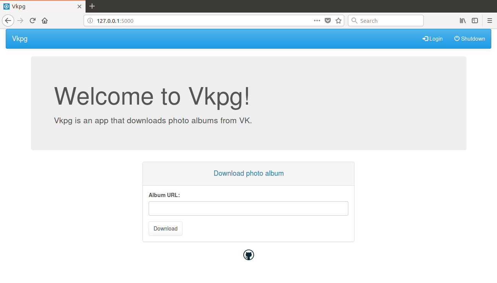

# Vkpg


## Requirements
In order to run __Vkpg__ you will need to create VK standalone app
to get keys for OAuth. See
[VK API docs](https://vk.com/dev/manuals)
for details.


## Installation
1. Create venv
```bash
virtualenv -p $(which python3) venv
```

2. Activate venv
```bash
source venv/bin/activate
```

3. Install dependencies
```bash
pip install -r requirements.txt
```


## Usage
1. Set env vars using your VK app info
```bash
export VKPG_SECRET_KEY="CSRF protection key"
export VKPG_VK_CONSUMER_KEY="Your VK app *Application ID*"
export VKPG_VK_CONSUMER_SECRET="Your VK app *Secure key*"
```

2. Run the app
```bash
python vkpg.py [-h/--help] [-d/--debug] [-nb/--no-browser] [port]
```
